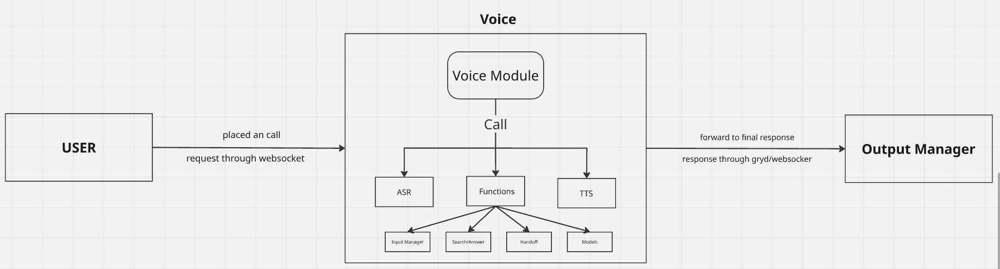

# Voice Service - Autobot

This will take of all the lifecycle of call activity.
It supports starting, ending and manging the call life_cycle.

# Voice - Autobot

This is a voice model will be used as a gryd worker or an API.
It aims to handle all the voice queries that can be used
during calls or voice related activity.

## Table of Contents

- [Running](#running)
- [Usage](#usage)
- [Sample Usage](#sample-usage)
- [Voice](#voice)
  - [How It Works	](#how-it-works)
  - [Module](#module)
    - [Conversation Manager](Conversation-manager)
    - [Input Manager](Input-manager)
    - [Models](#Models)

## Running

To run this model, you will required:

- To install the requirements

```
pip install ai_service-0.0.7-py3-none-any.whl
pip install -r requirements.txt
```

- To run

```
worker -m voice.py
```

## Usage

**Pre-requests**

- **`python>=3.8`**

## Sample Usage

```python
from gryd_worker import gyrd

gryd.SERVICE = "auto_bot-ctm"
gryd.set_queue_mananger(config={
    "broker_type": "sqs",
    "timeout" : 10,
    "wait_time_to_shutdown" : 43200
    #"input_queue" : input_queue
})
# Basic usage to place call
gryd.create_async_task(
	function_name ="call_twilio",
	service = "auto_bot-ctm",
	kwargs = {
		#Details to add specific to place the call
	},
	args = [] #add args if any
)
```

## Voice

This module provides how the voice model will work



Note:

* Each message put in message model every time and not at the end
* Each message is a separate object in message model

### How It Works

When a call starts — either initiated by the user or automatically by the autobot —> a connection request is sent to establish communication through websocket.

The **call lifecycle** then manages the flow of the conversation, including all the handoff between the user and the autobot.
Throughout the call, all messages are stored and updated in the **message model** to maintain a complete conversation history.

### Module

It aims to show the responsiblity of various modules that will take place in the voice

#### Conversation manager

Triggers call lifecycle on successful connect. Notifies the starting and end of conversation

#### Input manager

Triggers automated responses and workflows depending upon the user query
handles all the queries asked by user

#### Models

The Models module manages all data-related operations and user meta-data. It stores, retrieves, and updates conversation history and related call information so the system can maintain context across interactions.
